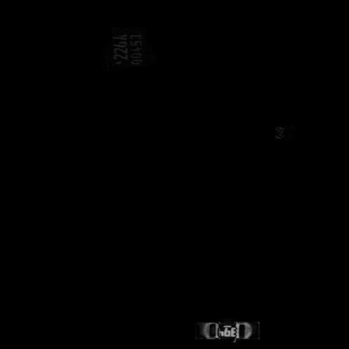
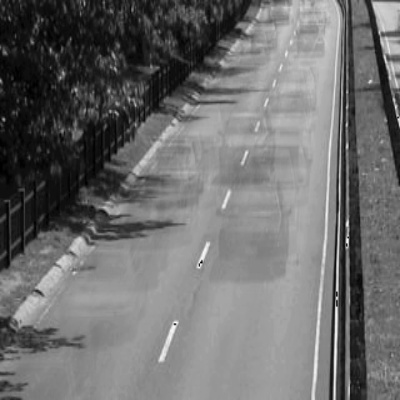

# image_processing_Assignment_22

<h2 align="center">a ==> Decode two images</h2>

After processing

<h2 align="center">c ==> rotate an image find difference between another image</h2>

After processing

<h2 align="center">d ==> Hide cars highway</h2>

After processing

<h2 align="center">e ==> Merge pictures</h2>

After processing

<h2 align="center">e_1 ==> fading pictures</h2>

After processing

https://github.com/schahinheidari/image_processing_Assignment_22/blob/97a169152171807ae63a672b88aee0f42db35585/images/result_5.1.mp4

<h2 align="center">f ==> Merge pictures</h2>

After processing

